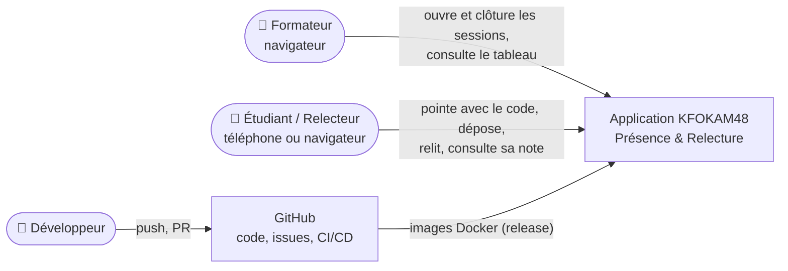
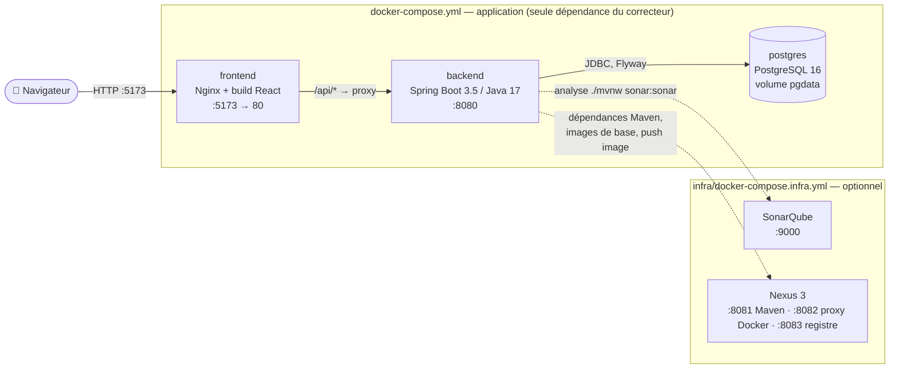
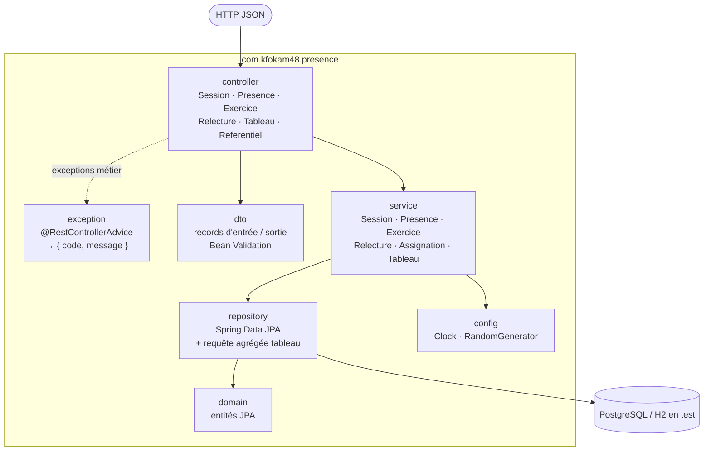
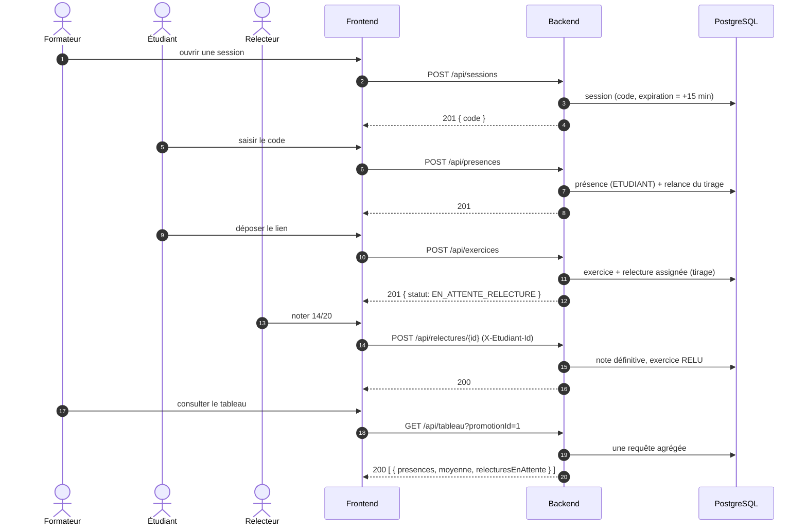
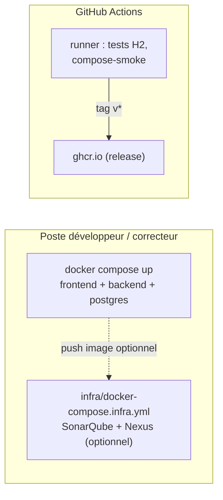
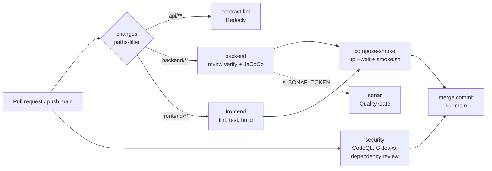

# Architecture — KFOKAM48 Présence & Relecture

**Auteur :** TCHANA Franck Hervé · KF48-YAO-260 · **Version :** 1 · **Date :** 25/09/2026

Une application web en trois tiers : un frontend React servi par Nginx, une API REST Spring Boot et une base PostgreSQL. Les trois conteneurs démarrent avec un seul `docker compose up`. Autour de l'application, et sans en être une dépendance, gravitent la CI GitHub Actions et un outillage local optionnel : SonarQube pour la qualité, Nexus pour le cache et le registre d'images.

> Documents liés : [Cahier des charges](CAHIER_DES_CHARGES.md) (EF, RG, hypothèses) · [Diagrammes D1–D4](diagrammes/) · [Contrat d'API](../api/contrat.yaml) · [Infrastructure optionnelle](INFRA.md) · [Contribuer](../CONTRIBUTING.md)

---

## 1. Contexte (C4 — niveau 1)



| Acteur | Accès | Authentification |
|---|---|---|
| Formateur | Écran `/formateur` | Aucune (hors périmètre, Q1) |
| Étudiant | Écran `/etudiant` : se choisit dans la liste de sa promotion | Aucune (Q1, risque accepté H7) |
| Relecteur | Écran `/relecture` : un étudiant à qui un exercice est assigné | Identité transmise par `X-Etudiant-Id` (H11) |

## 2. Conteneurs (C4 — niveau 2)



| Conteneur | Image | Rôle | Santé |
|---|---|---|---|
| `frontend` | `nginx:alpine` + `dist/` React | Sert les 3 écrans ; reverse proxy `/api` vers `backend` (pas de CORS) | `wget /` |
| `backend` | `eclipse-temurin:17-jre`, utilisateur non root | API REST, règles métier, migrations Flyway au démarrage | `/actuator/health` |
| `postgres` | `postgres:16` | Données ; volume nommé `pgdata` | `pg_isready` |
| `sonarqube` *(optionnel)* | `sonarqube:community` + base dédiée | Qualité, couverture JaCoCo, Quality Gate | `/api/system/status` |
| `nexus` *(optionnel)* | `sonatype/nexus3` | Cache Maven Central, proxy Docker Hub, registre d'images privé | `/service/rest/v1/status` |

**Règle d'or :** `docker compose up` ne référence jamais SonarQube ni Nexus. Leur absence ne casse ni le build, ni les tests, ni la CI, ni le démarrage.

## 3. Backend — composants (C4 — niveau 3)



| Couche | Responsabilité | Interdit (vérifié par ArchUnit, B3) |
|---|---|---|
| `controller` | Mapper HTTP ↔ DTO, statut de réponse | Appeler un repository, exposer une `@Entity` |
| `dto` | Records immuables, validation d'entrée | Logique métier |
| `service` | Règles RG1–RG18, transactions (`@Transactional`) | Dépendre d'un contrôleur |
| `repository` | Accès aux données, requêtes dérivées et JPQL | Règles métier |
| `domain` | Entités JPA conformes à D2 | Sérialisation JSON |
| `exception` | Exceptions métier + traduction centralisée (B4) | Stack trace dans la réponse |
| `config` | `Clock` (UTC) et `RandomGenerator` injectables | État global mutable |

### Services et règles portées

| Service | Opérations | Règles |
|---|---|---|
| `SessionService` | Ouvrir, clôturer, lister | RG1, H2, H5 |
| `PresenceService` | Pointage par code (ordre D3), ajout manuel | RG1–RG5, RG18 |
| `ExerciceService` | Dépôt, remplacement du lien, liste par étudiant | RG6–RG8, RG13, RG16 |
| `AssignationService` | Tirage du relecteur, relance à chaque présence | RG9, RG10, H1 |
| `RelectureService` | Rendu de la note, liste des relectures dues | RG10–RG12, H11 |
| `TableauService` | Agrégat par étudiant en une requête | RG14, RG15, ENF2 |

## 4. Données

Le schéma est décrit dans [D2](diagrammes/D2-modele-donnees.md) et créé uniquement par Flyway (B5).

| Élément | Choix |
|---|---|
| Migrations | `db/migration/V1__schema.sql`, puis `V2__…` ; une migration fusionnée ne se modifie jamais |
| Données de démo | `db/demo/R__demo_data.sql` (migration répétable), chargées hors profil `test` |
| Validation du mapping | `spring.jpa.hibernate.ddl-auto=validate` partout |
| Portabilité | SQL compatible PostgreSQL 16 et H2 (`MODE=PostgreSQL`) : `GENERATED BY DEFAULT AS IDENTITY`, `TIMESTAMP WITH TIME ZONE`, `VARCHAR(n)` |
| Temps | `Instant` en UTC, `Clock` injectée (RG1 testable sans attendre) |
| Intégrité | Unicités `presence(session_id, etudiant_id)`, `exercice(session_id, etudiant_id)`, `relecture(exercice_id)` ; `CHECK` note 0–20, statut, source |

## 5. API

Le contrat de référence est [`api/contrat.yaml`](../api/contrat.yaml). Les 5 opérations imposées sont conservées à l'identique : chemins, verbes, corps et codes de statut.

| Opération | Origine | Écran |
|---|---|---|
| `POST /api/sessions` | Imposée | Formateur |
| `POST /api/presences` | Imposée | Étudiant |
| `POST /api/exercices` | Imposée | Étudiant |
| `POST /api/relectures/{id}` | Imposée (+ en-tête optionnel `X-Etudiant-Id`) | Relecteur |
| `GET /api/tableau?promotionId=` | Imposée | Formateur |
| `GET /api/promotions`, `/api/promotions/{id}/etudiants`, `/api/promotions/{id}/sessions` | Ajoutées | Tous |
| `POST /api/sessions/{id}/presences`, `POST /api/sessions/{id}/cloture` | Ajoutées | Formateur |
| `PUT /api/exercices/{id}` | Ajoutée | Étudiant |
| `GET /api/etudiants/{id}/relectures`, `/api/etudiants/{id}/exercices` | Ajoutées | Relecteur, étudiant |

**Erreurs.** Toutes les erreurs ont le format `{ "code": "CODE_EXPIRE", "message": "..." }`. Sur les opérations imposées, les cas ajoutés réutilisent les codes de statut du contrat et se distinguent par la valeur de `code`.

## 6. Flux principal de bout en bout



Le détail des erreurs du pointage est dans [D3](diagrammes/D3-sequence-presence.md), le cycle de vie d'un exercice dans [D4](diagrammes/D4-etats-exercice.md).

## 7. Frontend

| Élément | Choix |
|---|---|
| Framework | React + Vite + TypeScript : trois écrans simples, build rapide, démarrage sans serveur Node en production |
| Routes | `/formateur`, `/etudiant`, `/relecture` (F2) |
| Couche API | `src/api/client.ts`, seul point d'appel HTTP ; il transforme `{ code, message }` en erreur affichable (F3) |
| États | Chargement, erreur et vide gérés sur chaque écran (F3) |
| Règles métier | Aucune : la moyenne, les statuts et les contrôles viennent de l'API (F3) |
| Production | `npm run build` → `dist/` servi par Nginx, qui relaie `/api` vers `backend:8080` |

## 8. Déploiement et environnements



| Environnement | Où | Base | Déclenchement |
|---|---|---|---|
| `dev` | Poste local, `docker compose up` | PostgreSQL + données de démo | Manuel |
| `test` | Runner CI et `./mvnw test` | H2 mode PostgreSQL, migrations réelles | Chaque commit et PR |
| `smoke` | Runner CI, job `compose-smoke` | PostgreSQL conteneurisé + démo | Chaque PR |
| `release` | Images `ghcr.io` (et Nexus local si actif) | — | Tag `v*` |

**Démarrage pour le correcteur :**

```bash
git clone https://github.com/FranckHerve100/kfokam48-epreuve-KF48-YAO-260.git
cd kfokam48-epreuve-KF48-YAO-260
docker compose up --build
```

Frontend : http://localhost:5173 · API : http://localhost:8080

## 9. Chaîne CI/CD



| Workflow | Déclencheur | Requis pour fusionner |
|---|---|---|
| `ci.yml` : `contract-lint`, `backend`, `frontend`, `compose-smoke` | PR vers `main`, push `main` | `backend`, `frontend` |
| `ci.yml` : `sonar` | Idem, seulement si `SONAR_TOKEN` et `SONAR_HOST_URL` sont définis | Non |
| `security.yml` | PR, push `main`, hebdomadaire | Recommandé |
| Dependabot | Mensuel (Maven, Docker, GitHub Actions) | — |

**Protection de `main` (ruleset)** : PR obligatoire, checks requis, force push et suppression bloqués, merge commit uniquement. Seuls les commits `[JALON]` contournent la règle (bypass administrateur).

## 10. Qualité et tests

| Niveau | Outil | Portée |
|---|---|---|
| Unitaire | JUnit 5, Mockito, AssertJ | Chaque RG, avec `Clock` fixe et hasard déterministe |
| Intégration | `@SpringBootTest` + MockMvc (H2) | Chaque ligne de réponse du contrat, statut et `code` |
| Conformité | `swagger-request-validator-mockmvc` | Chaque réponse validée contre `api/contrat.yaml` |
| Architecture | ArchUnit | Séparation des couches (B3) |
| Fumée / non-régression | `scripts/smoke.sh` contre les conteneurs | Parcours complet, en local et en CI |
| Frontend | Vitest + Testing Library | Couche API et états des écrans |
| Couverture | JaCoCo (≥ 70 % sur `service`) → SonarQube | Quality Gate sur le nouveau code |

**Non-régression.** Chaque PR rejoue toute la suite. Un bug corrigé commence toujours par un test `NR_<issue>_…` qui le reproduit. Aucun test n'est supprimé ni désactivé sans issue.

## 11. Sécurité

| Risque | Mesure |
|---|---|
| Fuite d'informations techniques | `@RestControllerAdvice` unique, `include-stacktrace=never`, 500 `ERREUR_INTERNE` générique |
| Secrets dans Git | `.env` ignoré, `.env.example` factice, secret scanning + push protection, Gitleaks en CI |
| Dépendances vulnérables | Dependabot, Dependency Review sur PR, CodeQL |
| Usurpation d'identité étudiant | Risque accepté par le client (Q1, H7) ; hors périmètre |
| Deviner le code de session | 6 caractères sur 32 symboles, expiration 15 min (RG1) ; blocage après 5 erreurs (RG4, étape 4) |
| Image conteneur | JRE seul, utilisateur non root, `HEALTHCHECK`, images de base épinglées |
| CORS | Évité : le frontend relaie `/api` via Nginx (même origine) |

## 12. Décisions d'architecture

| # | Décision | Alternative écartée | Raison |
|---|---|---|---|
| ADR-1 | Monorepo `backend/` + `frontend/`, isolés par CI, CODEOWNERS et images | Deux dépôts | Le sujet impose un seul dépôt projet |
| ADR-2 | Spring Boot 3.5.x | Spring Boot 4.x | Écosystème stable (Flyway, tests), moins de risque le jour J |
| ADR-3 | PostgreSQL en exécution, H2 mode PostgreSQL en test | Testcontainers | Les tests tournent sur un poste vierge sans Docker (B6) |
| ADR-4 | Contrat d'API figé ; cas ajoutés portés par `code`, pas par de nouveaux statuts | Ajouter 403, 404 ou 429 aux opérations imposées | « Mêmes codes de statut » exigé par le contrat |
| ADR-5 | Identité du relecteur par en-tête optionnel `X-Etudiant-Id` | Champ dans le corps | Le corps imposé reste inchangé (H11) |
| ADR-6 | Note définitive dès l'envoi (Q15) | Note modifiable jusqu'à la clôture (Q10) | Le contrat prévoit 409 sur une relecture déjà rendue |
| ADR-7 | Nginx relaie `/api` | CORS côté Spring | Même origine, configuration plus simple |
| ADR-8 | SonarQube et Nexus en outillage optionnel séparé | Les intégrer au démarrage | Le correcteur ne les a pas ; le démarrage doit rester autonome |

## 13. Arborescence du dépôt

```
kfokam48-epreuve-KF48-YAO-260/
├── .github/            templates issues/PR, CODEOWNERS, dependabot.yml, workflows/
├── api/contrat.yaml    contrat OpenAPI (5 opérations imposées + ajouts)
├── backend/            Spring Boot : src/main/java/com/kfokam48/presence/{controller,service,repository,domain,dto,exception,config}
│   ├── src/main/resources/db/{migration,demo}/
│   ├── Dockerfile, .dockerignore, mvnw, .mvn/
├── frontend/           React + Vite : src/{api,pages,components}, Dockerfile, nginx.conf
├── infra/              docker-compose.infra.yml, nexus/init.sh, sonar/init.sh (optionnels)
├── scripts/smoke.sh    tests de fumée / non-régression
├── docs/               CAHIER_DES_CHARGES.md, ARCHITECTURE.md, INFRA.md, JOURNAL.md, diagrammes/
├── docker-compose.yml  application : frontend + backend + postgres
├── .env.example, .gitignore, .editorconfig, redocly.yaml
└── README.md, CONTRIBUTING.md, CHANGELOG.md
```

---

## Journal des révisions

| Version | Quand | Ce qui a changé et pourquoi |
|---|---|---|
| 1 | 25/09/2026, étape 1 | Version initiale |
