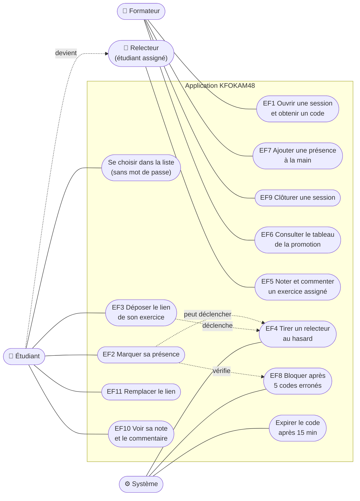

# D1 — Cas d'utilisation

Le relecteur n'est pas un acteur distinct : c'est un étudiant à qui le système a assigné un exercice (CDC §2). Il apparaît donc comme un rôle de l'étudiant, relié par une flèche en pointillés.

| Acteur | Cas d'utilisation | Règles |
|---|---|---|
| Formateur | EF1, EF6, EF7, EF9 | RG1, RG5, RG14, RG15 |
| Étudiant | EF2, EF3, EF10, EF11 | RG1–RG4, RG6–RG8, RG13, RG16, RG18 |
| Relecteur | EF5 | RG10, RG11, RG12 |
| Système | EF4, EF8, expiration | RG1, RG4, RG9, RG10 |

`EF2 peut déclencher EF4` : une nouvelle présence relance le tirage des exercices restés sans relecteur (CDC §7, H1).
