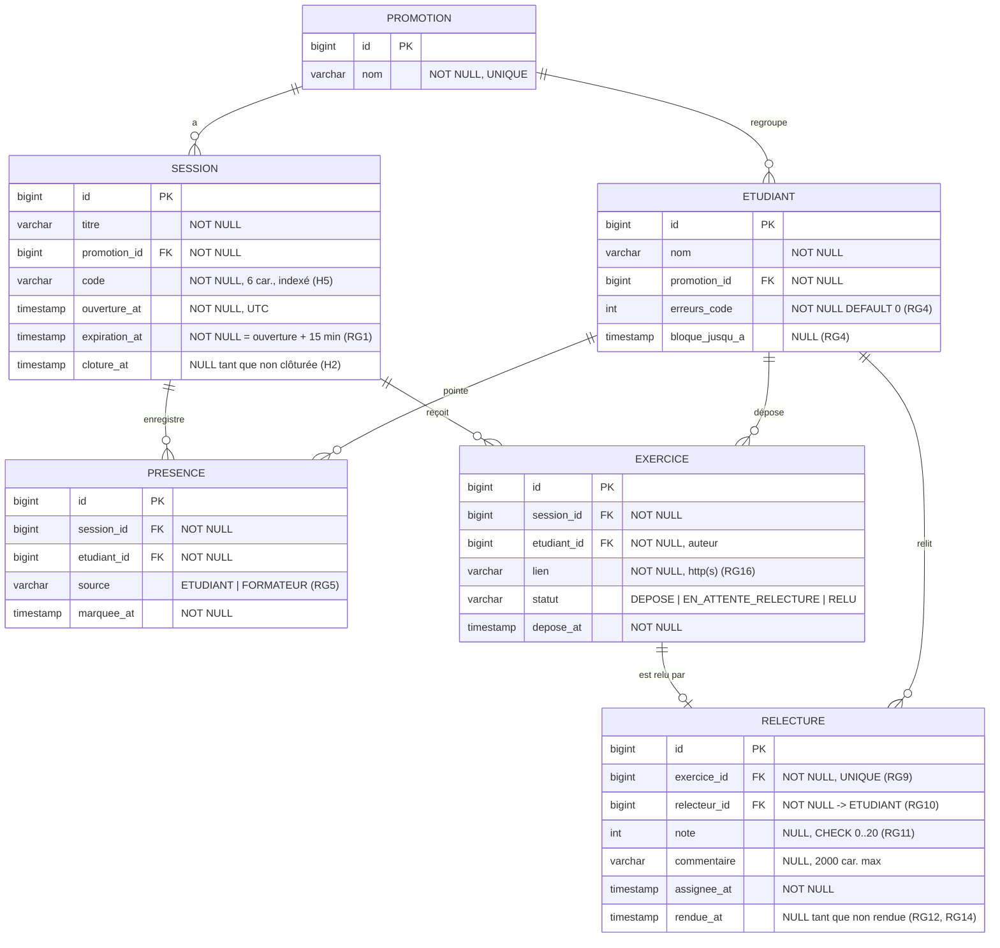

# D2 — Modèle de données

Ce diagramme correspond **exactement** à la migration `backend/src/main/resources/db/migration/V1__schema.sql`. Toute évolution du schéma passe par une nouvelle migration `V<n>__...sql` **et** par une mise à jour de ce fichier dans le même lot.

## Contraintes portées par la base

| Contrainte | Règle |
|---|---|
| `UNIQUE (session_id, etudiant_id)` sur `presence` | RG2 |
| `UNIQUE (session_id, etudiant_id)` sur `exercice` | RG6 |
| `UNIQUE (exercice_id)` sur `relecture` | RG9 |
| `CHECK (note BETWEEN 0 AND 20)` sur `relecture` | RG11 |
| `CHECK (source IN ('ETUDIANT','FORMATEUR'))` sur `presence` | RG5 |
| `CHECK (statut IN ('DEPOSE','EN_ATTENTE_RELECTURE','RELU'))` sur `exercice` | D4 |
| Index sur `session(code)` | H5, ENF3 |

Types portables PostgreSQL 16 / H2 (`MODE=PostgreSQL`) : `BIGINT GENERATED BY DEFAULT AS IDENTITY`, `VARCHAR(n)`, `TIMESTAMP WITH TIME ZONE`. Pas de `TEXT`, que `ddl-auto=validate` refuserait sous H2.

## Règles portées par le service (non exprimables en SQL)

- `relecture.relecteur_id <> exercice.etudiant_id` (RG10) et relecteur présent à la session.
- Unicité du `code` parmi les sessions **non expirées** seulement (H5).
- Une ligne `relecture` n'existe qu'une fois le relecteur tiré : un exercice `DEPOSE` n'en a pas (H1).
