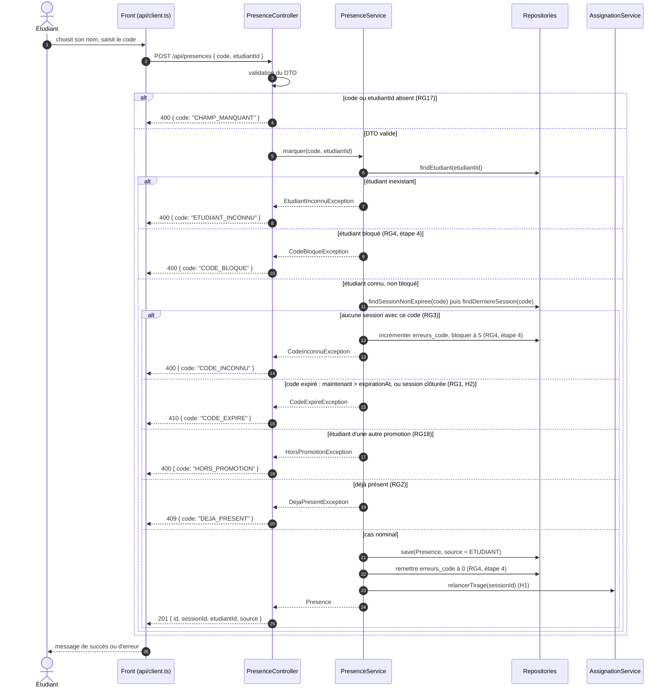

# D3 — Séquence : marquer sa présence

`POST /api/presences { code, etudiantId }`. Chaque branche correspond à un code HTTP **du contrat** `api/contrat.yaml` : 201, 400, 409 ou 410, et aucun autre, car l'opération est imposée. Les cas ajoutés par le cahier des charges réutilisent ces statuts et se distinguent par la valeur de `code`. Les contrôles s'exécutent **dans cet ordre** : c'est l'ordre que suivent le service et ses tests.

| Branche | HTTP | `code` | Règle | Test d'intégration attendu |
|---|---|---|---|---|
| Champ manquant | 400 | `CHAMP_MANQUANT` | RG17 | `RG17_presenceSansCode_renvoie400` |
| Étudiant inexistant | 400 | `ETUDIANT_INCONNU` | EF2 | `presence_etudiantInconnu_renvoie400` |
| Étudiant bloqué | 400 | `CODE_BLOQUE` | RG4 (étape 4) | `RG4_apres5Erreurs_renvoie400CodeBloque` |
| Code inconnu | 400 | `CODE_INCONNU` | RG3 | `RG3_codeInconnu_renvoie400` |
| Code expiré ou session clôturée | 410 | `CODE_EXPIRE` | RG1, H2 | `RG1_codeExpireApres15Minutes_renvoie410` |
| Hors promotion | 400 | `HORS_PROMOTION` | RG18 | `RG18_etudiantAutrePromotion_renvoie400` |
| Déjà présent | 409 | `DEJA_PRESENT` | RG2 | `RG2_dejaPresent_renvoie409` |
| Nominal | 201 | — | EF2 | `EF2_codeValide_renvoie201SourceEtudiant` |

Le blocage après 5 codes erronés (RG4) est une story Should (EF8) : il est placé dans la séquence pour fixer l'ordre des contrôles, mais il est livré à l'étape 4. Les colonnes `erreurs_code` et `bloque_jusqu_a` existent dès `V1` (D2).
