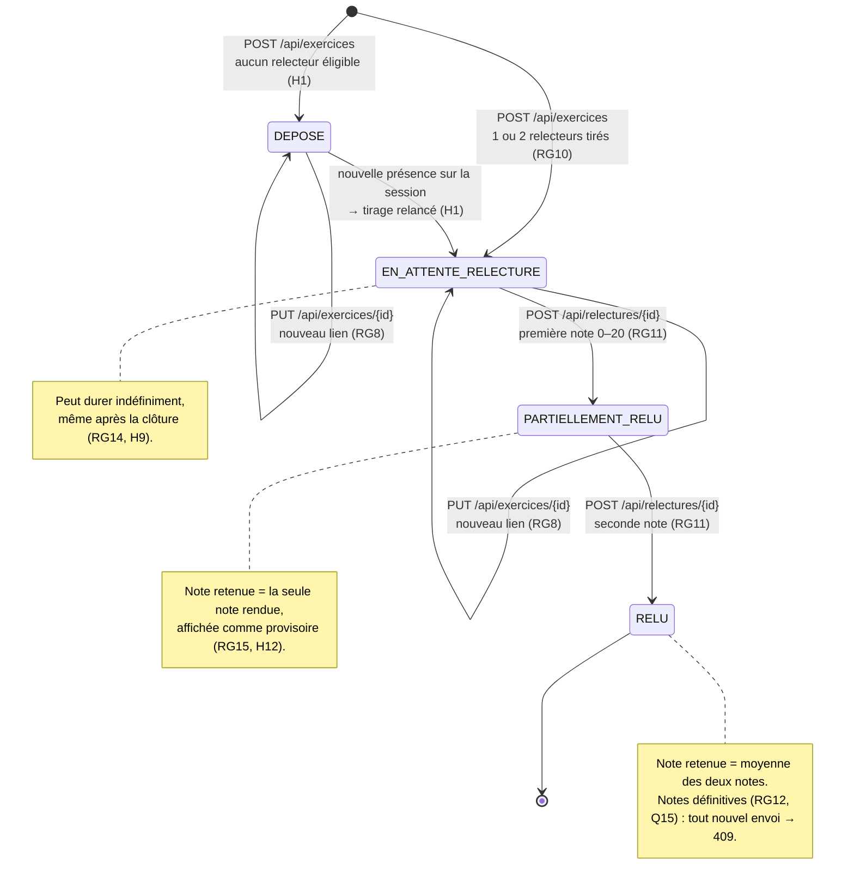

# D4 — États-transitions du cycle de vie d'un exercice

*v2 (étape 3, changement de besoin) : chaque exercice est relu par deux pairs. Le statut `PARTIELLEMENT_RELU` porte la note provisoire, en attendant la seconde relecture.*

| Transition | Déclencheur | Refusée si | Code |
|---|---|---|---|
| → `DEPOSE` ou `EN_ATTENTE_RELECTURE` | Dépôt | Session clôturée ; déjà déposé ; lien invalide ; session ou étudiant inconnu ; étudiant hors promotion | 409 / 409 / 400 / 400 / 400 |
| `DEPOSE` → `EN_ATTENTE_RELECTURE`, ou second relecteur | Nouvelle présence sur la session (tirage après validation de la présence, #50) | — | — |
| Remplacement du lien | `PUT /api/exercices/{id}` | Session clôturée ; une relecture rendue | 409 |
| `EN_ATTENTE_RELECTURE` → `PARTIELLEMENT_RELU` → `RELU` | Relectures rendues, une par relecteur | Note invalide ou relecture inconnue ; relecteur = auteur ou non assigné ; déjà rendue | 400 / 403 / 409 |

Données antérieures à la migration V2 : un exercice déjà `RELU` avec un seul relecteur reste `RELU` (note définitive, RG12) ; un exercice `EN_ATTENTE_RELECTURE` avec un seul relecteur reçoit son second relecteur à la prochaine présence.
