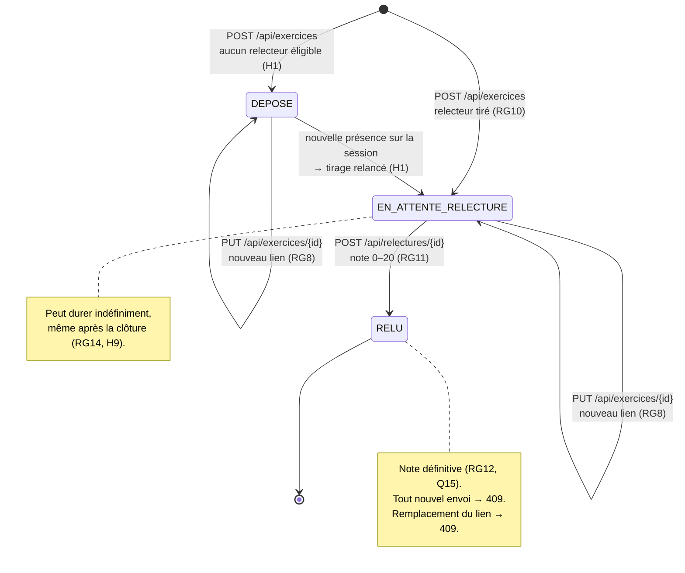

# D4 — États-transitions du cycle de vie d'un exercice

| Transition | Déclencheur | Refusée si | Code |
|---|---|---|---|
| → `DEPOSE` ou `EN_ATTENTE_RELECTURE` | Dépôt | Session clôturée ; déjà déposé ; lien invalide ; session ou étudiant inconnu ; étudiant hors promotion | 409 / 409 / 400 / 400 / 400 |
| `DEPOSE` → `EN_ATTENTE_RELECTURE` | Nouvelle présence sur la session | — | — |
| Remplacement du lien | `PUT /api/exercices/{id}` | Session clôturée ; état `RELU` | 409 |
| `EN_ATTENTE_RELECTURE` → `RELU` | Relecture rendue | Note invalide ou relecture inconnue ; relecteur = auteur ou non assigné ; déjà rendue | 400 / 403 / 409 |
